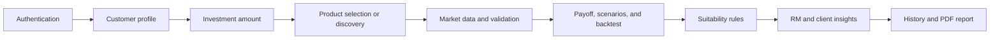

# AstraForge

**Team AstraForge**

AstraForge is a suitability-aware structured-product advisory workspace for Relationship Managers (RMs). It combines deterministic payoff calculations, market scenarios, historical backtesting, client suitability rules, grounded explanations, and downloadable client reports in one React and FastAPI application.

> AstraForge is an illustrative decision-support tool. It is not an investment recommendation, an approved institutional suitability policy, or a substitute for an issuer term sheet.

## What the project provides

- Product configuration for Equity-Linked Notes (ELN), Dual Currency Deposits (DCD), and Capital-Protected Notes (CPN).
- Deterministic payoff calculations and payoff curves.
- Standard and custom market-shock scenarios.
- Historical rolling-window backtests using bundled or Yahoo Finance market data.
- Client profiling across risk appetite, objective, horizon, loss tolerance, liquidity, and concentration.
- Rule-based suitability results with `PASS`, `WARNING`, and `MISMATCH` outcomes.
- Product discovery against products saved in the current browser session.
- RM and client explanation views, with deterministic fallback content and optional Gemini enhancement.
- English, Hindi, and Marathi client PDF reports.
- Supabase authentication support, with a local development fallback when Supabase is not configured.
- Responsive RM workspace, assessment history, reports, and profile management.

## Technology stack

| Layer | Technology |
|---|---|
| Frontend | React 19, Vite 8, React Router, Tailwind CSS, Recharts, Lucide React |
| Backend | Python 3.12+, FastAPI, Uvicorn, Pydantic |
| Financial analysis | NumPy, pandas, deterministic Python payoff engines |
| Market data | Bundled NIFTY snapshot and Yahoo Finance through `yfinance` |
| Authentication | Supabase Auth and profiles, with local browser-based development mode |
| AI explanations | Google Gemini, with validated deterministic fallback explanations |
| Reports | `@react-pdf/renderer` |
| Testing | Pytest, Playwright, Oxlint, Vite production build |

## Quick start

### Prerequisites

- Python 3.12 or newer (Python 3.13 is tested)
- Node.js 22.12 or newer (Node 22 is recommended)
- npm
- Git Bash only if you want to use `run.sh` on Windows

### Windows: start the complete project

Open PowerShell or Command Prompt in the repository root:

```powershell
cd D:\MindSpark\Team_AstraForge
.\run.cmd
```

The launcher creates `.venv`, installs missing backend and frontend dependencies, starts both servers, and verifies that the frontend, backend, and development proxy respond.

### Git Bash, macOS, or Linux

```bash
cd Team_AstraForge
bash run.sh
```

### Local URLs

| Service | URL |
|---|---|
| AstraForge web app | http://localhost:5173 |
| FastAPI documentation | http://localhost:8000/docs |
| OpenAPI schema | http://localhost:8000/openapi.json |
| Backend health check | http://localhost:8000/health |

Press `Ctrl+C` in the launcher terminal to stop both servers.

### Useful launcher commands

```powershell
# Check that dependencies are installed without starting servers
.\run.cmd --check

# Reuse installed dependencies
.\run.cmd --skip-install

# Start, verify readiness, and stop automatically
.\run.cmd --smoke --skip-install

# Use custom ports
.\run.cmd --backend-port 8001 --frontend-port 5174

# Disable FastAPI auto-reload
.\run.cmd --no-reload
```

The launcher never terminates an existing process occupying a requested port. Stop that process or select different ports.

## Manual setup

### 1. Install backend dependencies

From the repository root on Windows:

```powershell
py -3.13 -m venv .venv
.\.venv\Scripts\python.exe -m pip install -r backend\requirements.txt
```

On macOS or Linux:

```bash
python3 -m venv .venv
./.venv/bin/python -m pip install -r backend/requirements.txt
```

### 2. Install frontend dependencies

```powershell
cd frontend
npm ci
cd ..
```

### 3. Start the backend

```powershell
.\.venv\Scripts\python.exe -m uvicorn app.main:app --app-dir backend --reload
```

### 4. Start the frontend

Open a second terminal:

```powershell
cd frontend
npm run dev
```

Vite proxies `/api` and `/health` to `http://127.0.0.1:8000` by default.

## Environment configuration

The project works in local development mode without external credentials. Optional services are enabled through environment files.

### Backend environment: `.env`

Create `.env` in the repository root. Start from `.env.example` for Gemini configuration.

```dotenv
# Optional AI-enhanced explanation selection
GEMINI_API_KEY=replace_with_your_gemini_api_key
GEMINI_MODEL=gemini-3.8-flash

# Optional backend verification of Supabase JWTs
SUPABASE_JWT_SECRET=replace_with_your_supabase_jwt_secret

# Optional deployed frontend origin for CORS
FRONTEND_URL=http://localhost:5173
```

If Gemini is unavailable or not configured, AstraForge returns the built-in grounded explanation. Gemini selects among validated explanation variants; financial results still come from deterministic engines.

### Frontend environment: `frontend/.env`

Copy `frontend/.env.example` to `frontend/.env` and enter your Supabase public values:

```dotenv
VITE_SUPABASE_URL=https://your-project-id.supabase.co
VITE_SUPABASE_ANON_KEY=your-supabase-anon-key

# Optional when the API is hosted separately from the frontend
VITE_API_BASE_URL=http://localhost:8000
```

When the Supabase values are absent or placeholders, the frontend uses its local authentication simulation. Production Supabase setup requires running [the profiles schema](docs/supabase_auth_schema.sql) in the Supabase SQL editor.

Never commit real API keys, Supabase secrets, or populated `.env` files.

## Application workflow

The main RM journey is organized into the following stages:

1. **Sign in** - Authenticate through Supabase or local development mode. Role guards route RMs to the advisory workspace and clients to the client portal.
2. **Add a customer** - Capture identity, risk appetite, objective, investment horizon, acceptable loss, liquidity needs, and optional portfolio exposure data.
3. **Set the investment amount** - Record the proposed investment and portfolio currency.
4. **Select or configure a product** - Reuse a saved ELN, DCD, or CPN, discover a match, or configure new product terms.
5. **Prepare market inputs** - Validate the instrument and currency, then obtain the available reference price and history.
6. **Run the simulation** - Calculate payoff, payoff curve, market scenarios, historical backtest, and derived product-risk measures.
7. **Evaluate suitability** - Compare product risk with six client dimensions: appetite, horizon, loss tolerance, concentration, liquidity, and objective.
8. **Explain the result** - Display RM-facing and client-facing explanations based only on trusted calculation and suitability outputs.
9. **Save and report** - Store an immutable assessment snapshot in the browser session and download an English, Hindi, or Marathi PDF report.



## Product modules

| Module | Main capabilities |
|---|---|
| ELN | Coupon and barrier terms, strike treatment, payoff curve, shock scenarios, path-aware backtesting, and loss measures |
| DCD | Deposit and alternate currencies, conversion strike, coupon, settlement legs, FX scenarios, backtesting, and conversion risk |
| CPN | Protected base, upside participation, optional cap and coupon, payoff curve, scenarios, backtesting, and protection disclosures |

All calculations are deterministic. AI does not calculate payoffs, market events, loss bounds, or suitability statuses.

## Frontend modules and components

| Area | Location | Responsibility |
|---|---|---|
| Application routing | `frontend/src/App.jsx` | Public auth routes, protected RM routes, client route, and lazy-loaded results |
| Authentication | `frontend/src/auth/` | Login, signup, verification, reset flow, Supabase client, local fallback, and role guards |
| Shared assessment state | `frontend/src/state/AssessmentContext.jsx` | Customer, amount, product, simulation, suitability, insights, saved products, and history |
| Layout | `frontend/src/components/layout/` | Sidebar, top navigation, responsive shell, and active assessment context |
| Product setup | `frontend/src/components/ProductConfiguration.jsx` and `frontend/src/pages/*Configure*` | ELN, DCD, and CPN configuration and validation |
| Market selection | `frontend/src/components/UnderlyingSearch.jsx` | Search, selection, and instrument feedback |
| Simulation UI | `frontend/src/components/simulation/` | Historical price chart and market movement controls |
| ELN results | `frontend/src/components/PayoffChart.jsx` and `ScenarioCards.jsx` | Payoff visualization and scenario presentation |
| DCD results | `frontend/src/components/dcd/` | DCD payoff, scenarios, backtest, and risk notes |
| CPN results | `frontend/src/components/cpn/` | CPN payoff, scenarios, backtest, and risk notes |
| Suitability insights | `frontend/src/components/insights/` | RM/client explanations, suitability details, audience controls, and PDF generation |
| Product discovery | `frontend/src/components/discovery/` | Alignment score and saved-product match cards |
| Shared UI | `frontend/src/components/ui/` | Page titles, workflow states, notices, metrics, and reusable cards |
| Pages | `frontend/src/pages/` | Dashboard, customers, products, discovery, results, insights, history, reports, and RM profile |
| API client | `frontend/src/lib/api.js` | Request handling, timeouts, and normalized API errors |
| Styling | `frontend/src/index.css`, `astraforge-theme.css`, `landing.css` | Base components, AstraForge theme, responsive layout, and public landing page |

### Main frontend routes

| Route | Purpose |
|---|---|
| `/` | Public landing page or authenticated RM overview |
| `/login`, `/signup` | Authentication |
| `/verify-email`, `/forgot-password`, `/reset-password` | Account recovery and verification |
| `/clients` | Customer profile capture |
| `/simulator` | Saved products and product creation |
| `/simulator/eln` | ELN configuration |
| `/simulator/dcd` | DCD configuration |
| `/simulator/cpn` | CPN configuration |
| `/simulator/budget` | Investment amount and currency |
| `/simulator/results` | Payoff, scenario, and historical results |
| `/simulator/suitability` | Customer-product suitability |
| `/simulator/insights` | RM and client explanations |
| `/discovery` | Match saved products to the active customer |
| `/history` | Session assessment history |
| `/reports` | Downloadable client reports |
| `/profile` | RM profile |
| `/client` | Protected client portal |

## Backend modules

| Module | Responsibility |
|---|---|
| `main.py` | FastAPI application, middleware, core routes, and router registration |
| `domain.py`, `errors.py` | Shared domain types and safe API error handling |
| `phase2_models.py`, `phase2_engines.py` | Validated ELN, DCD, and CPN payoff contracts and pure calculations |
| `phase3_sim_models.py`, `phase3_simulation.py` | Scenario and historical backtest schemas and engines |
| `phase3_market_data.py` | Market catalog, symbol search, data retrieval, cache, and provenance |
| `phase4_models.py`, `phase4_suitability.py` | Client risk profile and deterministic suitability policy |
| `products.py` | Reusable product templates, validation, and customer-specific preparation |
| `services.py` | Integrated simulation and suitability orchestration |
| `cpn/` | CPN-specific payoff, curve, scenarios, backtest, schemas, and loss measures |
| `dcd/` | DCD-specific payoff, curve, scenarios, backtest, schemas, and loss measures |
| `discovery/` | Saved-product evaluation and alignment ranking |
| `agents/` | Trusted insight inputs, translations, fallback explanations, and optional Gemini selection |
| `auth.py`, `auth_routes.py` | JWT user resolution, RM role protection, and verification endpoints |

## Core API groups

Interactive request and response schemas are available at `/docs`.

| Group | Endpoints |
|---|---|
| Health and identity | `GET /health`, `GET /me` |
| Payoff engines | `POST /api/payoff/eln`, `/api/payoff/dcd`, `/api/payoff/cpn` |
| Market data | `GET /api/market-data/catalog`, `/search`, `/history` |
| Product library | `POST /api/products/validate`, `/api/products/prepare` |
| Integrated simulation | `POST /api/simulation/run` |
| Scenario and backtest | `POST /api/scenarios/simulate`, `/api/backtest/run` |
| Suitability | `POST /api/suitability/check`, `/api/suitability/evaluate` |
| Discovery | `POST /api/discovery/evaluate` |
| Insights | `POST /api/insights/generate` |
| CPN detail APIs | `GET /api/cpn/underlyings`; payoff, curve, scenarios, backtest, and loss-measure POST routes |
| DCD detail APIs | `GET /api/dcd/pairs`; payoff, curve, scenarios, backtest, and loss-measure POST routes |
| Authentication support | `POST /auth/send-verification`, `/auth/verify-token` |

Detailed financial contracts are documented in [API contracts](docs/API_CONTRACTS.md). Export the current OpenAPI snapshot with:

```powershell
.\.venv\Scripts\python.exe scripts\export_schema.py
```

## State and persistence

- Products and completed assessments are stored in browser `sessionStorage` under `astraforge.session.v1`.
- The latest 30 assessment snapshots are retained in the active browser tab.
- Closing the tab can remove session data.
- Saved product templates do not contain customer identity or customer investment amounts.
- Preparing a saved product refreshes available reference data while preserving its contractual terms.
- The backend suitability audit and insight cache are bounded in-memory development adapters and reset when the backend restarts.
- Supabase stores authentication users and profiles when configured; it does not currently provide durable product or assessment storage.

## Project structure

```text
Team_AstraForge/
|-- backend/
|   |-- app/
|   |   |-- agents/          # Grounded insight generation and translations
|   |   |-- cpn/             # Capital-Protected Note domain
|   |   |-- dcd/             # Dual Currency Deposit domain
|   |   |-- discovery/       # Product matching
|   |   |-- main.py          # FastAPI entry point
|   |   |-- services.py      # Integrated orchestration
|   |   `-- phase*.py        # Payoff, simulation, market, and suitability layers
|   |-- data/                # Bundled market snapshots
|   |-- scripts/             # Data refresh utility
|   |-- tests/               # Backend unit and API tests
|   `-- requirements.txt
|-- frontend/
|   |-- e2e/                 # Playwright workflow tests
|   |-- public/              # Logo, icons, and fonts
|   |-- src/
|   |   |-- auth/            # Authentication and route protection
|   |   |-- components/      # Shared and product-specific UI
|   |   |-- pages/           # Route-level screens
|   |   |-- state/           # Assessment session state
|   |   |-- lib/             # API client
|   |   `-- App.jsx          # Route map
|   |-- package.json
|   `-- vite.config.js
|-- docs/                    # Architecture, contracts, schema, and validation notes
|-- scripts/dev.py           # Cross-platform development supervisor
|-- run.cmd                  # Windows command entry point
|-- run.ps1                  # Windows bootstrap
|-- run.sh                   # Bash entry point
`-- README.md
```

## Validation commands

Run these from the repository root unless stated otherwise.

```powershell
# Verify the complete launcher and HTTP readiness
.\run.cmd --smoke --skip-install

# Backend unit and API tests
.\.venv\Scripts\python.exe -m pytest -q

# Frontend lint
cd frontend
npm run lint

# Frontend production build
npm run build

# Browser workflow tests (starts isolated servers automatically)
npm run test:e2e
```

Playwright uses installed Microsoft Edge by default. To use installed Chrome:

```powershell
$env:PLAYWRIGHT_CHANNEL = "chrome"
npm run test:e2e
```

See [validation notes](docs/VALIDATION.md) for coverage and known constraints.

## Financial and technical limitations

- Payoffs and suitability rules are illustrative and must be checked against actual product term sheets and institutional policy.
- Capital protection applies at contractual maturity and remains subject to issuer creditworthiness.
- Historical backtests use closing observations, overlapping windows, and a 252-trading-day year approximation; they do not capture intraday barrier events.
- Results exclude fees, taxes, transaction costs, issuer default, and early-sale valuation unless explicitly modeled.
- Yahoo Finance availability and metadata can change or fail. The bundled NIFTY data is labeled as an unverified snapshot, not a live quote.
- Portfolio and product currencies must match. The application does not automatically translate portfolio values across currencies.
- Browser session state and in-memory backend adapters are not production-grade persistence or audit systems.
- Gemini enhances wording selection only. It cannot change verified calculations or rule outcomes.

## Additional documentation

- [Architecture](docs/ARCHITECTURE.md)
- [API contracts](docs/API_CONTRACTS.md)
- [Financial foundation review](docs/FOUNDATION_REVIEW.md)
- [Developer handoff](docs/HANDOFF.md)
- [Validation](docs/VALIDATION.md)
- [Supabase authentication schema](docs/supabase_auth_schema.sql)

## Team

Developed by **Team AstraForge**.
